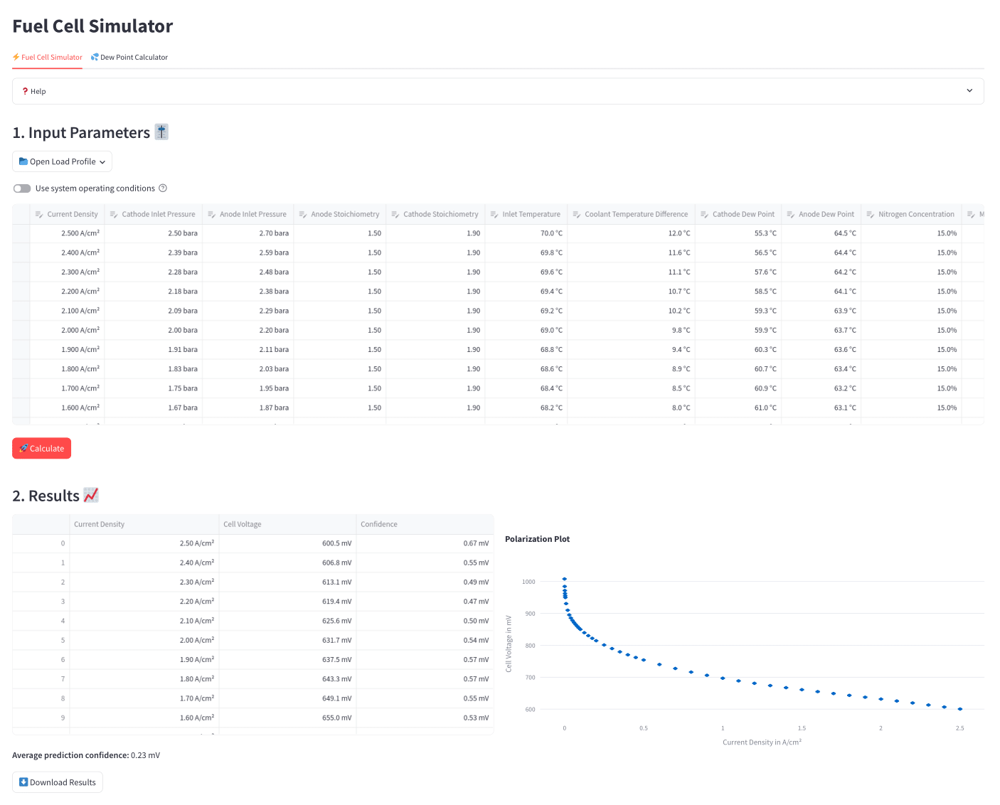

# Fuel Cell Simulator
The fuel cell simulator provides a graphical user interface to predict the cell voltage of a fuel cell based on its operating conditions.
The simulator uses a neural network based digital twin that was developed for fuel cell performance prediction.
More details about the digital twin can be found in the [Fuel Cell Digital Twin]() article.



## Getting started
To run the fuel cell simulator, you need to have Python installed on your machine.
1. Clone the repository to your local machine.
    ```bash
    git clone
    ```
2. Install the required packages by running the following command in the terminal:
    ```bash
    pip install -r requirements.txt
    ```
3. Run the simulator by executing the following command in the terminal:
    ```bash
    streamlit run src/main.py
    ```
